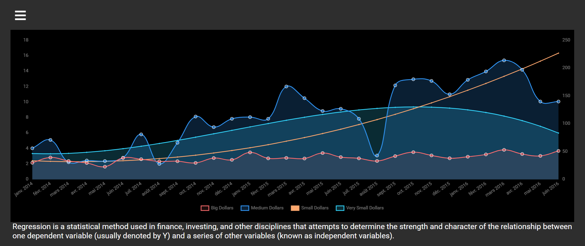
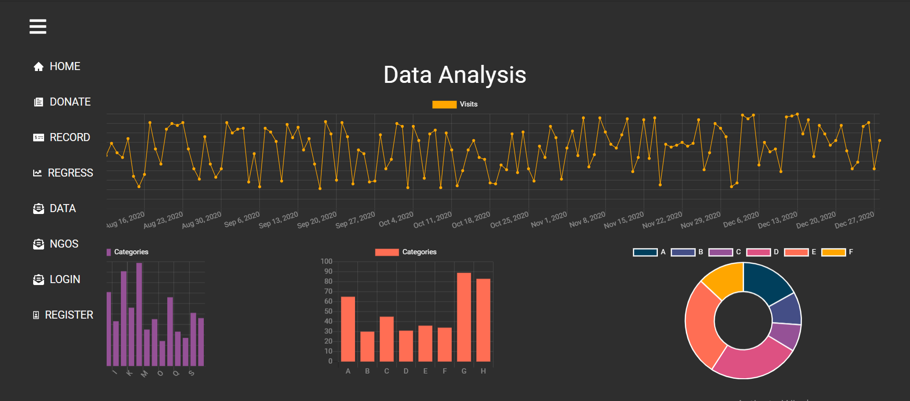
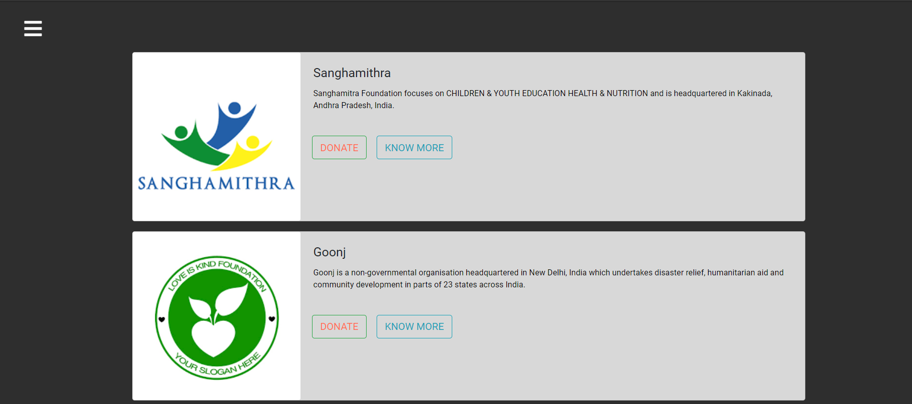
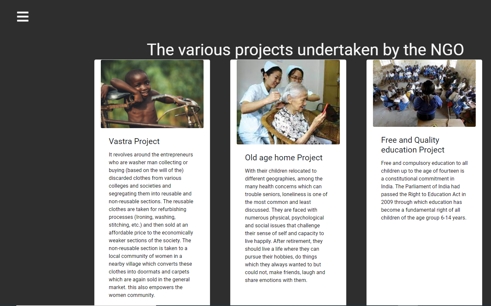

# Donation-Management-System
A donation management system for NGOs and Donors. The project is designed for Cognizance IITR 2021 - Salesforce Codathon.
This app was built by the team Dangling Pointers.

For this project we have used React with the proposal of using cloud databases such as Atlas(Mongodb).
We have used additional packages ass well such as Chart.js for visualisation purposes and Regression.js for data analysis and regressive plotting of data.
An initial attempt was made by us to make the machine learning model using the Tensorflow JS framework but the accuracy of the model was even below a baseline model.
So we had to eventually give up on that line of work and use the packages mentioned.



## Tech Stack

- ### Libraries

        React
        Bootstrap
        Chart.js
        Regression.js



## How to run locally

- Clone the repository on your system.
- Move into the folder and Run the command in the terminal

```js

npm install
npm start

```

- Visit "http://localhost:3000" on your browser
- Now you are all set to start!

## Regression Model

For the machine learning part several models were tried including Linear Regression with Lasso and Ridge Optimizers and Polynomial Regressor.The best result came through Polynomial Regression.The data used here is randomly generated by us and is trying to replicate the actual data that we would receive when actual donors contribute to the app.

## Workflow

So the app workflow is as follows:
First the NGOs needs to register and then using those credentials he needs to log in which would lead him to the main page. There they can list out various projects which they are curretly working on.

Now the donors will be able to see them in the list of organisations and projects to which they can contribute.
After the user makes the donation then it is added to the transaction page and simultaneously that data would also be used for analysis purposes.(For Statistical Analysis and Regression Analysis).



## Directory Structre

```
|-- README.md
|-- node_modules
|-- package-lock.json
|-- package.json
|--  public
|   |   |-- background.jpg
|   |   |-- favicon.ico
|   |   |-- index.html
|   |   |-- logo192.png
|   |   |-- logo512.png
|   |   |-- manifest.json
|   |   `-- robots.txt
|   |-- src
|   |   |-- index.js
|   |   |-- Components
|   |   |   |-- About.js
|   |   |   |-- AllNGOsDisplay.js
|   |   |   |-- App.js
|   |   |   |-- BarChart.js
|   |   |   |-- Data.js
|   |   |   |-- Doughnut.js
|   |   |   |-- Form.js
|   |   |   |-- LineChart.js
|   |   |   |-- Navbar.js
|   |   |   |-- NGOlogin.js
|   |   |   |-- NGOprojects.js
|   |   |   |-- NGOregister.js
|   |   |   |-- Regression.js
|   |   |   |-- Sidebar.js
|   |   |   |-- Transaction.js
|   |   |-- data
|   |   |   |-- index.js
|   |   |-- style
|   |   |   |-- index.css

```
